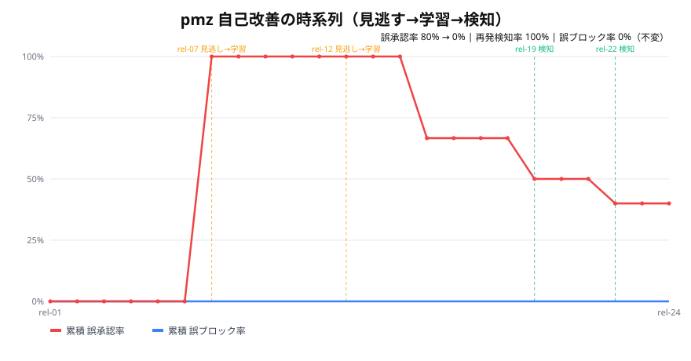

# ai-hackathon

[](https://github.com/godhuu0505/ai-hackathon/actions/workflows/ci.yml)

DevOps × AI Agent Hackathon 2026: AI エージェントを「つくる、まわす、とどける」夏

提出作品 **pmz** — AIリリース判定ゲートキーパー × 自己改善エージェント。
名称 `pmz` の由来は **PM観点 × Z軸（自己改善）**（要件 [§1.1](docs/requirements.md)）。
要件定義は [`docs/requirements.md`](docs/requirements.md)、W1技術設計は [`docs/w1-technical-design.md`](docs/w1-technical-design.md)。

## AI駆動開発ハーネス

本リポジトリは Claude Code で AI 駆動開発を回すための **ハーネス（足場）** を備えています。

- プロジェクトメモリ: [`CLAUDE.md`](CLAUDE.md)（MVPスコープ・設計インバリアント・コマンド・規約）
- ハーネスの設計意図と適用したベストプラクティス: [`.claude/README.md`](.claude/README.md)
- 起動フックが `uv sync` で依存を導入するため、セッション開始後すぐ `uv run pytest -q` /
  `uv run ruff check .` が通ります。

### MVP スケルトン

- `src/pmz/models.py` — 合成リリース履歴のデータモデル（要件 §9.1）。
- `src/pmz/signals.py` — 客観シグナルの構造的隔離（§5 #1）。
- `src/pmz/core/` — 条件付き自律の判定コア（`judge` / `hard_guard` / `decision`・§3.4 / §7 #5）。
- `tests/` — pytest。lint は ruff。`uv sync` → `uv run pytest -q` で検証。

### W2: 自己改善ループ（作品の心臓・§3.3.1 / §6.1 / §9.1）

「**見逃す → 振り返りで学習 → 同型を検知**」を合成データ（~24件）で再現します。

- `src/pmz/data/synthetic_releases.json` — trap→learn→catch のアーク（24件・§9.1）。
- `src/pmz/learning/` — ルール自動進化（`rulebook`）・記憶/Few-shot（`memory`）・
  振り返り（`retrospective`）。学習の正解ラベルは **客観イベントからのみ** 導出（インバリアント #6）。
- `src/pmz/eval/` — 混同行列・F-beta（`metrics`）と学習前後のバックテスト（`backtest`）。

デモ（学習前後の精度比較）:
```
uv run python -m pmz.eval.backtest
```
結果: **誤承認率 80% → 0%**、**再発アーキタイプ検知率 100%**、**誤ブロック率は 0% で不変**
（KPI §6.1 を達成）。

時系列の可視化（依存ゼロで SVG を生成・§6.1 デモの目玉）:
```
uv run python -m pmz.eval.visualize    # docs/assets/self_improvement.svg を書き出す
```


誤承認率が trap（見逃し→学習）で跳ね、catch（検知）以降は下がっていく一方、誤ブロック率は
0% のまま不変 ――「賢くなっている様子」を一枚で示します。

### W3: マルチエージェント＋権限分離＋監査証跡（§4.1 / §7 #3・#4 / §8.1 ⑤⑥）

- `src/pmz/agents/` — オーケストレータ＋3つの **読むエージェント**（`code_risk` / `pm_req` /
  `retrospective`）。**権限分離**: reader は構造化シグナル・所見・提案のみを出し承認権限を持たない。
  最終判定（`GateDecision`）を出すのは Orchestrator が呼ぶ `judge()` だけで、根拠は構造化シグナルのみ
  ＝ PR本文への注入文だけでは判定を覆せない（§7 #3）。
- `src/pmz/audit.py` — 全判定を **ハッシュチェーンで改ざん検知可能**に追記する監査証跡
  （入力ハッシュ / 判定 / 確信度 / 根拠 / 発火ルール / モデル・プロンプト版 / 寄与エージェント・§7 #4 / §5.2）。
  途中1件でも改変すると `AuditLog.verify()` が検知する（Firestore 永続化は Phase2）。

## grill-me — 要件ヒアリングスキル

オープンソースの [`grill-me`](https://github.com/mattpocock/skills) の思想をベースに、
**要件をめちゃくちゃ深掘りヒアリングする** Claude Code スキルを導入しています。

- 場所: `.claude/skills/grill-me/SKILL.md`
- 使い方: Claude Code 上で「**grill me**」「**要件をヒアリングして**」「**この企画を壁打ちして**」
  などと話しかけると起動します
- 動き: AI が実装には手を出さず、インタビュアーに徹して
  背景 → 目的 → ユーザー → スコープ → 機能/非機能要件 → 制約 → 成功指標 → リスク
  を一問ずつ徹底的に深掘りします
- 成果物: `grill-me-sessions/<plan-name>.grill.md` に決定・保留・確定要件が蓄積され、
  そのまま要件定義のドラフトになります

### クイックスタート
```
あなた:  grill me。新しい在庫管理アプリの要件を詰めたい
Claude:  まずセッション名を決めましょう。短いプラン名は?（例: inventory-app）
あなた:  inventory-app
Claude:  了解。では背景から。なぜ今これを作るのですか? — 今ある一番の痛みは?
...（一問ずつ深掘りが続く）
```
